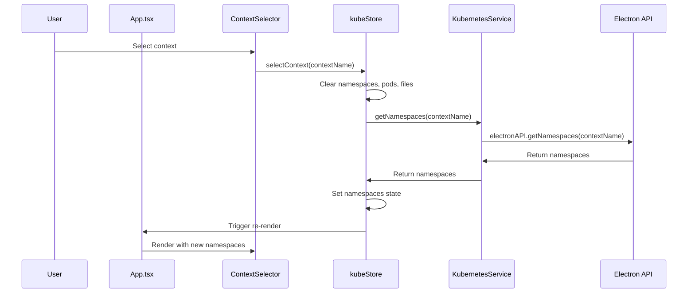
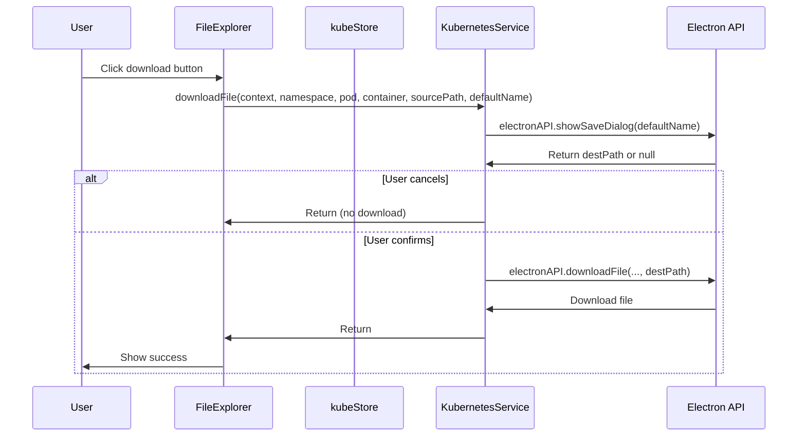

# K8sDownloader Architecture

## Overview

K8sDownloader is a desktop application built with Electron, React, and TypeScript that allows users to browse and download files from Kubernetes pods. The application follows a modern, modular architecture with clear separation of concerns.

## Architecture Diagram

```
┌─────────────────────────────────────────────────────────────┐
│                         K8sDownloader                         │
├─────────────────────────────────────────────────────────────┤
│                                                               │
│  ┌─────────────────────┐    ┌────────────────────────────┐ │
│  │   Main Process       │    │    Renderer Process          │ │
│  │   (Electron)         │    │    (React + Vite + Zustand)   │ │
│  │                      │    │                                │ │
│  │  main.ts             │    │  main.tsx                    │ │
│  │  └── Window Mgmt     │    │  └── React bootstrap         │ │
│  │  └── IPC Handlers    │    │                                │ │
│  │  └── Menu Mgmt       │    │  App.tsx                     │ │
│  │  └── Auto Updater    │    │  └── App shell               │ │
│  │                      │    │                                │ │
│  │  kubernetes.ts       │    │  app/                        │ │
│  │  └── K8s Service     │    │    layout/                   │ │
│  │  └── kubectl Exec    │    │      MainLayout.tsx         │ │
│  │  └── File Ops        │    │      Sidebar.tsx            │ │
│  │                      │    │      Header.tsx             │ │
│  │  preload.ts          │    │                                │ │
│  │  └── API Exposure    │    │    features/                  │ │
│  └──────────────────────┘    │      contexts/               │ │
│                             │        components/           │ │
│  ┌─────────────────────┐    │        hooks/                 │ │
│  │   Shared             │    │        services/             │ │
│  │   (Both Processes)   │    │        types/                │ │
│  │                      │    │      namespaces/             │ │
│  │  types/              │    │      pods/                   │ │
│  │    kubernetes.ts     │    │      filesystem/             │ │
│  │    api.ts             │    │      ui/                     │ │
│  │    errors.ts          │    │                                │ │
│  │  constants/          │    │    shared/                   │ │
│  │    index.ts          │    │      types/                  │ │
│  │  utils/              │    │      constants/             │ │
│  │    *                 │    │      utils/                  │ │
│  └──────────────────────┘    │    lib/                      │ │
│                             │      components/             │ │
│                             │        Button.tsx            │ │
│                             │        Input.tsx             │ │
│                             │        Select.tsx            │ │
│                             │        ...                   │ │
│                             │      api/                     │ │
│                             │        electronApi.ts         │ │
│                             │      stores/                  │ │
│                             │        kubeStore.ts           │ │
│                             │        uiStore.ts             │ │
│                             │      services/                │ │
│                             │        kubernetesService.ts  │ │
│                             └────────────────────────────┘ │
│                                                               │
└─────────────────────────────────────────────────────────────┘
                              │
                    ┌─────────▼─────────┐
                    │   kubectl CLI      │
                    │   (spawnSync)      │
                    └─────────┬─────────┘
                              │
                    ┌─────────▼─────────┐
                    │  Kubernetes API    │
                    └───────────────────┘
```

## Key Architectural Decisions

### 1. Feature-based Organization

The application follows a "vertical slices" approach where each feature (contexts, namespaces, pods, filesystem) is self-contained with its own:
- Components
- Hooks
- Services
- Types

**Benefits:**
- Better separation of concerns
- Easier to maintain and test
- Clear feature boundaries
- Reduced coupling between features

### 2. State Management with Zustand

Instead of using React context or individual hooks, the application uses **Zustand** for centralized state management.

**Key Stores:**
- `kubeStore.ts`: Manages all Kubernetes-related state (contexts, namespaces, pods, files)
- `uiStore.ts`: Manages UI state (theme, etc.)

**Benefits:**
- Single source of truth
- No prop drilling
- Better performance (no unnecessary re-renders)
- Easier to test and debug

### 3. Service Layer Abstraction

The `KubernetesService` class provides a clean interface for all Kubernetes operations, abstracting the direct Electron API calls.

**Benefits:**
- Centralized API communication
- Easier to mock for testing
- Single point of change if API changes
- Better error handling

### 4. Shared Types Package

All TypeScript types are centralized in `src/shared/types/` and re-exported for easy import.

**Benefits:**
- No type duplication
- Consistent types across the application
- Easy to maintain and extend

### 5. Error Handling

Structured error handling with `AppError` class and error codes.

**Benefits:**
- Consistent error messages
- Better debugging
- Easy to handle different error types

## Data Flow

### Context Selection Flow



### File Download Flow



## Performance Optimizations

### 1. Component Memoization

Key components are memoized to prevent unnecessary re-renders:
- `ContextSelector`
- `NamespaceSelector`
- `PodSelector`
- `FileExplorer`
- `FileRow` (with custom comparison function)

### 2. Debounced Search

The pod search input uses a 300ms debounce to avoid excessive filtering.

### 3. Virtualization (Planned)

For large file lists, react-window is available for virtualization.

### 4. Code Splitting

Vite's automatic code splitting with manual chunks for large dependencies:
- React
- Zustand
- Kubernetes client

## Error Handling Strategy

### Error Types

```typescript
export enum ErrorCode {
  KUBECONFIG_NOT_FOUND = 'KUBECONFIG_NOT_FOUND',
  KUBECTL_NOT_INSTALLED = 'KUBECTL_NOT_INSTALLED',
  KUBECTL_EXEC_FAILED = 'KUBECTL_EXEC_FAILED',
  CONTEXT_NOT_FOUND = 'CONTEXT_NOT_FOUND',
  NAMESPACE_NOT_FOUND = 'NAMESPACE_NOT_FOUND',
  POD_NOT_FOUND = 'POD_NOT_FOUND',
  CONTAINER_NOT_FOUND = 'CONTAINER_NOT_FOUND',
  FILE_NOT_FOUND = 'FILE_NOT_FOUND',
  PERMISSION_DENIED = 'PERMISSION_DENIED',
  NETWORK_ERROR = 'NETWORK_ERROR',
  TIMEOUT = 'TIMEOUT',
  UNKNOWN_ERROR = 'UNKNOWN_ERROR',
}
```

### Error Handling Flow

1. **Service Layer**: Catches errors and wraps them in `AppError`
2. **Store Layer**: Sets error state and global error
3. **Component Layer**: Displays error messages
4. **ErrorBoundary**: Catches unhandled errors
5. **ErrorDialog**: Shows global errors to user

## Security Considerations

### 1. Context Isolation

Electron's context isolation is enabled to prevent direct Node.js access from the renderer process.

### 2. Input Validation

All user inputs are validated before being passed to kubectl commands.

### 3. Error Sanitization

Error messages are sanitized before being displayed to prevent information leakage.

## Testing Strategy

### Test Coverage

- **Unit Tests**: Individual components and hooks
- **Integration Tests**: Feature interactions
- **E2E Tests**: Complete user flows (planned)

### Test Tools

- **Vitest**: Fast unit testing
- **React Testing Library**: Component testing
- **MSW**: API mocking (planned)

## Build & Deployment

### Build Process

```bash
# Development
pnpm dev

# Production build
pnpm build

# Electron build
pnpm electron:build
```

### Build Output

- `dist/`: Web assets
- `dist-electron/`: Electron main and preload scripts
- `release/`: Platform-specific installers

### Environment Variables

- `NODE_ENV`: Development or production
- `VITE_APP_VERSION`: Application version

## Future Improvements

### 1. Advanced Caching

- Implement React Query for server state management
- Add cache invalidation strategies

### 2. Enhanced Error Recovery

- Automatic retry for transient errors
- Better error recovery mechanisms

### 3. Performance Monitoring

- Add startup time tracking
- Memory usage monitoring
- Performance metrics

### 4. Accessibility Improvements

- Better keyboard navigation
- Screen reader support
- ARIA attributes

### 5. Internationalization

- Add i18n support
- Multiple language support

## Migration Guide

### From Original Architecture

1. **Replace individual hooks** with Zustand store
2. **Update imports** to use feature-based paths
3. **Replace direct API calls** with KubernetesService
4. **Update error handling** to use AppError
5. **Add memoization** to components

### Example Migration

**Before:**
```typescript
// Old hook-based approach
const ctx = useKubeConfig();
const ns = useNamespaces();
```

**After:**
```typescript
// New store-based approach
const ctx = useContexts();
const ns = useNamespaces();
```

## Conclusion

The K8sDownloader architecture provides a solid foundation for a maintainable, scalable, and performant desktop application. The feature-based organization, centralized state management, and service layer abstraction make it easy to extend and maintain the application while ensuring good performance and user experience.