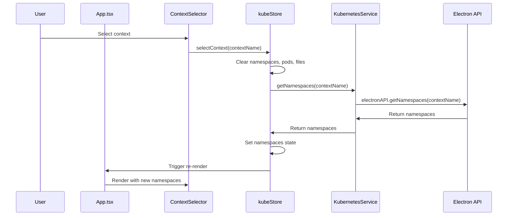
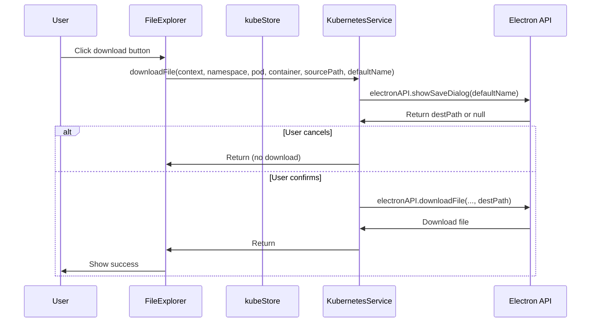

# K8sDownloader Architecture

## Overview

K8sDownloader is a desktop application built with Electron, React, and TypeScript that allows users to browse and download files from Kubernetes pods. The application follows a modern, modular architecture with clear separation of concerns.

## Architecture Diagram

```
┌─────────────────────────────────────────────────────────────┐
│                         K8sDownloader                         │
├─────────────────────────────────────────────────────────────┤
│                                                               │
│  ┌─────────────────────┐    ┌────────────────────────────┐ │
│  │   Main Process       │    │    Renderer Process          │ │
│  │   (Electron)         │    │    (React + Vite + Zustand)   │ │
│  │                      │    │                                │ │
│  │  main.ts             │    │  main.tsx                    │ │
│  │  └── Window Mgmt     │    │  └── React bootstrap         │ │
│  │  └── IPC Handlers    │    │                                │ │
│  │  └── Menu Mgmt       │    │  App.tsx                     │ │
│  │  └── Auto Updater    │    │  └── App shell               │ │
│  │                      │    │                                │ │
│  │  kubernetes.ts       │    │  app/                        │ │
│  │  └── K8s Service     │    │    layout/                   │ │
│  │  └── kubectl Exec    │    │      MainLayout.tsx         │ │
│  │  └── File Ops        │    │      Sidebar.tsx            │ │
│  │                      │    │      Header.tsx             │ │
│  │  preload.ts          │    │                                │ │
│  │  └── API Exposure    │    │    features/                  │ │
│  └──────────────────────┘    │      contexts/               │ │
│                             │        components/           │ │
│  ┌─────────────────────┐    │        hooks/                 │ │
│  │   Shared             │    │        services/             │ │
│  │   (Both Processes)   │    │        types/                │ │
│  │                      │    │      namespaces/             │ │
│  │  types/              │    │      pods/                   │ │
│  │    kubernetes.ts     │    │      filesystem/             │ │
│  │    api.ts             │    │      ui/                     │ │
│  │    errors.ts          │    │                                │ │
│  │  constants/          │    │    shared/                   │ │
│  │    index.ts          │    │      types/                  │ │
│  │  utils/              │    │      constants/             │ │
│  │    *                 │    │      utils/                  │ │
│  └──────────────────────┘    │    lib/                      │ │
│                             │      components/             │ │
│                             │        Button.tsx            │ │
│                             │        Input.tsx             │ │
│                             │        Select.tsx            │ │
│                             │        ...                   │ │
│                             │      api/                     │ │
│                             │        electronApi.ts         │ │
│                             │      stores/                  │ │
│                             │        kubeStore.ts           │ │
│                             │        uiStore.ts             │ │
│                             │      services/                │ │
│                             │        kubernetesService.ts  │ │
│                             └────────────────────────────┘ │
│                                                               │
└─────────────────────────────────────────────────────────────┘
                              │
                    ┌─────────▼─────────┐
                    │   kubectl CLI      │
                    │   (spawnSync)      │
                    └─────────┬─────────┘
                              │
                    ┌─────────▼─────────┐
                    │  Kubernetes API    │
                    └───────────────────┘
```

## Key Architectural Decisions

### 1. Feature-based Organization

The application follows a "vertical slices" approach where each feature (contexts, namespaces, pods, containers, filesystem) is self-contained with its own:
- Components
- Hooks
- Services
- Types

**Benefits:**
- Better separation of concerns
- Easier to maintain and test
- Clear feature boundaries
- Reduced coupling between features

### 2. State Management with Zustand

Instead of using React context or individual hooks, the application uses **Zustand** for centralized state management.

**Key Stores:**
- `kubeStore.ts`: Manages all Kubernetes-related state (contexts, namespaces, pods, containers, files)
- `uiStore.ts`: Manages UI state (theme, etc.)

**Benefits:**
- Single source of truth
- No prop drilling
- Better performance (no unnecessary re-renders)
- Easier to test and debug

### 3. Service Layer Abstraction

The `KubernetesService` class provides a clean interface for all Kubernetes operations, abstracting the direct Electron API calls.

**Benefits:**
- Centralized API communication
- Easier to mock for testing
- Single point of change if API changes
- Better error handling

### 4. Shared Types Package

All TypeScript types are centralized in `src/shared/types/` and re-exported for easy import.

**Benefits:**
- No type duplication
- Consistent types across the application
- Easy to maintain and extend

### 5. Error Handling

Structured error handling with `AppError` class and error codes.

**Benefits:**
- Consistent error messages
- Better debugging
- Easy to handle different error types

## Data Flow

### Context Selection Flow


```mermaid
sequenceDiagram
    participant U as User
    participant A as App.tsx
    participant C as ContextSelector
    participant S as kubeStore
    participant K as KubernetesService
    participant E as Electron API

    U->>C: Select context
    C->>S: selectContext(contextName)
    S->>S: Clear namespaces, pods, files
    S->>K: getNamespaces(contextName)
    K->>E: electronAPI.getNamespaces(contextName)
    E->>K: Return namespaces
    K->>S: Return namespaces
    S->>S: Set namespaces state
    S->>A: Trigger re-render
    A->>C: Render with new namespaces
```

### File Download Flow


```mermaid
sequenceDiagram
    participant U as User
    participant F as FileExplorer
    participant S as kubeStore
    participant K as KubernetesService
    participant E as Electron API

    U->>F: Click download button
    F->>K: downloadFile(context, namespace, pod, container, sourcePath, defaultName)
    K->>E: electronAPI.showSaveDialog(defaultName)
    E->>K: Return destPath or null
    alt User cancels
        K->>F: Return (no download)
    else User confirms
        K->>E: electronAPI.downloadFile(..., destPath)
        E->>K: Download file
        K->>F: Return
        F->>U: Show success
    end
```

## Security Boundaries

The Electron main process is the security boundary for all Kubernetes operations. Before any `kubectl exec` call is issued, the application validates the selected context, namespace, pod name, container name, and container path. Traversal-style paths and malformed identifiers are rejected before they reach the command layer.

Renderer code never executes kubectl directly; it only communicates with the preload bridge and the main process. The Electron window also runs with sandboxing enabled to reduce the impact of renderer-level compromise.

### Recent Implementation Updates

- The main Electron window now uses sandboxing enabled for stronger isolation.
- Renderer-side access to the Electron bridge is routed through a shared interface with a safe fallback, preventing startup crashes when the bridge is unavailable in non-Electron contexts.
- Shared type definitions now centralize the preload contract to keep the IPC surface consistent across the service layer and the legacy API helpers.
- Pods with more than one container expose a `ContainerSelector` dropdown (`features/containers/`); the first container is selected automatically on pod selection, and switching containers resets the file browser to the container's root directory. The `-c`/`--container` flag plumbing in `electron/kubernetes.ts` and the container-name validation already existed and required no changes — only the renderer-side selection state (`selectedContainer` in `kubeStore.ts`) was added.
- An info button in the file explorer's breadcrumb bar opens a `PodDetailsOverlay` (`features/pods/`) showing the selected pod's status, node, pod IP, creation time, controller ("managed by"), and per-container image/ready/restart-count details. Unlike the rest of the Kubernetes state, pod details are fetched on demand — only when the overlay is opened — via a dedicated `get-pod-details` IPC channel (`getPodDetails` in `electron/kubernetes.ts`, one `kubectl get pod <name> -o json` call), rather than being folded into the `get-pods` list payload every pod list load would otherwise carry. The fetch/loading/error state lives in a standalone `usePodDetails` hook rather than `kubeStore.ts`, since it is transient UI-only state with a single consumer.
- A second button next to it downloads the selected pod/container's logs (`downloadPodLogs` in `electron/kubernetes.ts`, one `kubectl logs` invocation streamed straight to disk via the same `execToFile` helper `downloadFile` uses) through the native save dialog, following the `download-pod-logs` IPC channel and `KubernetesService.downloadPodLogs` pattern exactly as `download-file`/`downloadFile` do. The suggested file name (`<pod-name>-YYYY-MM-DD-HH-mm.log`) is computed renderer-side by `formatLogFileName` in `utils/kubeconfig.ts`. Unlike `downloadFile`, there is no cat/type/tar fallback chain — `kubectl logs` behaves the same regardless of what tools the container image ships.
- `getPodDetails` also cross-references `pod.spec.volumes` with each container's `volumeMounts` to build a `mounts: PodVolumeMount[]` list per container (mount path, read-only flag, subPath, and a classified `sourceType`/`sourceDetail`). `describeVolumeSource` classifies ConfigMap/Secret/PersistentVolumeClaim/HostPath/NFS/CSI as bringing data in from "outside" the container image, versus EmptyDir/Projected/DownwardAPI which are pod-local or Kubernetes-internal; `PodDetailsOverlay` highlights the "outside" sources with a distinct badge style so users can tell which paths in the file browser are backed by external data.
- `PodDetailsOverlay` is resizable: a grip handle in the bottom-right corner drags the dialog's width/height (tracked in local `useState`, clamped to `UI.POD_DETAILS_WIDTH_MIN/MAX` and `..._HEIGHT_MIN/MAX` in `shared/constants`), following the same delta-from-drag-start approach as the sidebar resize in `App.tsx` but scoped locally to the component instead of lifted to app state — the size only matters while the overlay is open and has no other consumer. The dialog switched from content-sized (`max-w-lg`/`max-h-[60vh]`) to an explicit `flex flex-col` layout with a `flex-1 min-h-0 overflow-y-auto` body so the fixed pixel size still scrolls correctly at any dimension.

## Performance Optimizations

### 1. Component Memoization

Key components are memoized to prevent unnecessary re-renders:
- `ContextSelector`
- `NamespaceSelector`
- `PodSelector`
- `ContainerSelector`
- `FileExplorer`
- `FileRow` (with custom comparison function)

### 2. Debounced Search

The pod search input uses a 300ms debounce to avoid excessive filtering.

### 3. Virtualization (Planned)

For large file lists, react-window is available for virtualization.

### 4. Code Splitting

Vite's automatic code splitting with manual chunks for large dependencies:
- React
- Zustand
- Kubernetes client

## Error Handling Strategy

### Error Types

```typescript
export enum ErrorCode {
  KUBECONFIG_NOT_FOUND = 'KUBECONFIG_NOT_FOUND',
  KUBECTL_NOT_INSTALLED = 'KUBECTL_NOT_INSTALLED',
  KUBECTL_EXEC_FAILED = 'KUBECTL_EXEC_FAILED',
  CONTEXT_NOT_FOUND = 'CONTEXT_NOT_FOUND',
  NAMESPACE_NOT_FOUND = 'NAMESPACE_NOT_FOUND',
  POD_NOT_FOUND = 'POD_NOT_FOUND',
  CONTAINER_NOT_FOUND = 'CONTAINER_NOT_FOUND',
  FILE_NOT_FOUND = 'FILE_NOT_FOUND',
  PERMISSION_DENIED = 'PERMISSION_DENIED',
  NETWORK_ERROR = 'NETWORK_ERROR',
  TIMEOUT = 'TIMEOUT',
  UNKNOWN_ERROR = 'UNKNOWN_ERROR',
}
```

### Error Handling Flow

1. **Service Layer**: Catches errors and wraps them in `AppError`
2. **Store Layer**: Sets error state and global error
3. **Component Layer**: Displays error messages
4. **ErrorBoundary**: Catches unhandled errors
5. **ErrorDialog**: Shows global errors to user

## Security Considerations

### 1. Context Isolation

Electron's context isolation is enabled to prevent direct Node.js access from the renderer process.

### 2. Input Validation

All user inputs are validated before being passed to kubectl commands.

### 3. Error Sanitization

Error messages are sanitized before being displayed to prevent information leakage.

## Testing Strategy

### Test Coverage

- **Unit Tests**: Individual components and hooks
- **Integration Tests**: Feature interactions
- **E2E Tests**: Complete user flows (planned)

### Test Tools

- **Vitest**: Fast unit testing
- **React Testing Library**: Component testing
- **MSW**: API mocking (planned)

### Testing `electron/kubernetes.ts`

`vite-plugin-electron-renderer` (needed so the renderer bundle can polyfill
Node built-ins) rewrites bare specifiers like `"fs"`, `"os"`, `"child_process"`
into browser shims — importing `electron/kubernetes.ts` in a test breaks
unless every Node built-in it imports is mocked with `vi.mock(...)` first, so
the real module (and its shim) is never resolved. Vite/Vitest treat a bare
specifier and its `"node:"`-prefixed form (`"fs"` vs `"node:fs"`) as the same
underlying module, so if both are mocked in the same test file, they must
share the same mock object — otherwise whichever `vi.mock` call wins silently
shadows the other. See `electron/kubernetes.test.ts` for the pattern.

## Build & Deployment

### Build Process

```bash
# Development
pnpm dev

# Production build
pnpm build

# Electron build
pnpm electron:build
```

### Build Output

- `dist/`: Web assets
- `dist-electron/`: Electron main and preload scripts
- `release/`: Platform-specific installers

### Environment Variables

- `NODE_ENV`: Development or production
- `VITE_APP_VERSION`: Application version

## Future Improvements

### 1. Advanced Caching

- Implement React Query for server state management
- Add cache invalidation strategies

### 2. Enhanced Error Recovery

- Automatic retry for transient errors
- Better error recovery mechanisms

### 3. Performance Monitoring

- Add startup time tracking
- Memory usage monitoring
- Performance metrics

### 4. Accessibility Improvements

- Better keyboard navigation
- Screen reader support
- ARIA attributes

### 5. Internationalization

- Add i18n support
- Multiple language support

## Migration Guide

### From Original Architecture

1. **Replace individual hooks** with Zustand store
2. **Update imports** to use feature-based paths
3. **Replace direct API calls** with KubernetesService
4. **Update error handling** to use AppError
5. **Add memoization** to components

### Example Migration

**Before:**
```typescript
// Old hook-based approach
const ctx = useKubeConfig();
const ns = useNamespaces();
```

**After:**
```typescript
// New store-based approach
const ctx = useContexts();
const ns = useNamespaces();
```

## Conclusion

The K8sDownloader architecture provides a solid foundation for a maintainable, scalable, and performant desktop application. The feature-based organization, centralized state management, and service layer abstraction make it easy to extend and maintain the application while ensuring good performance and user experience.